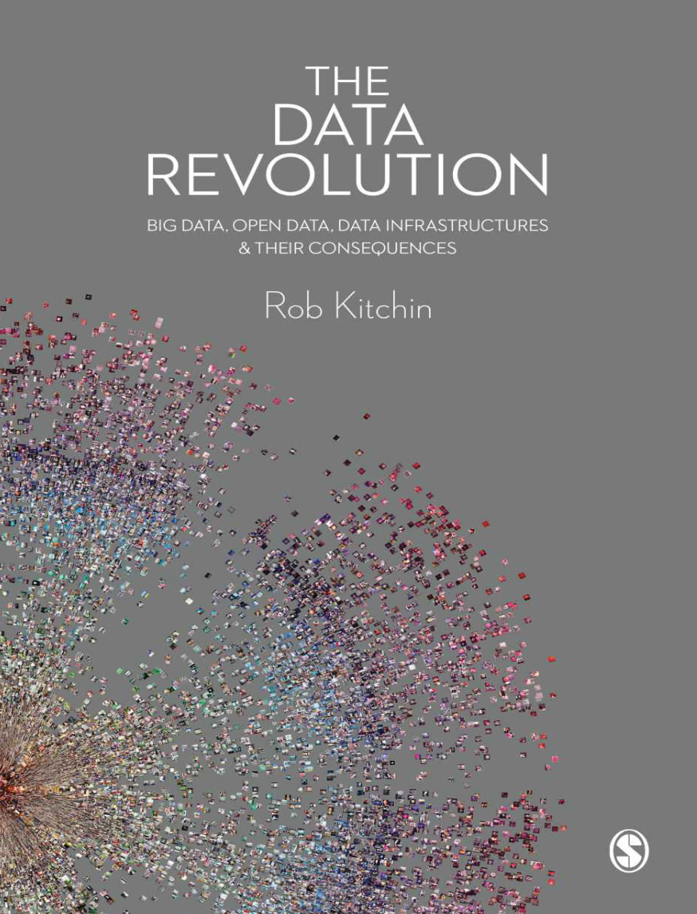
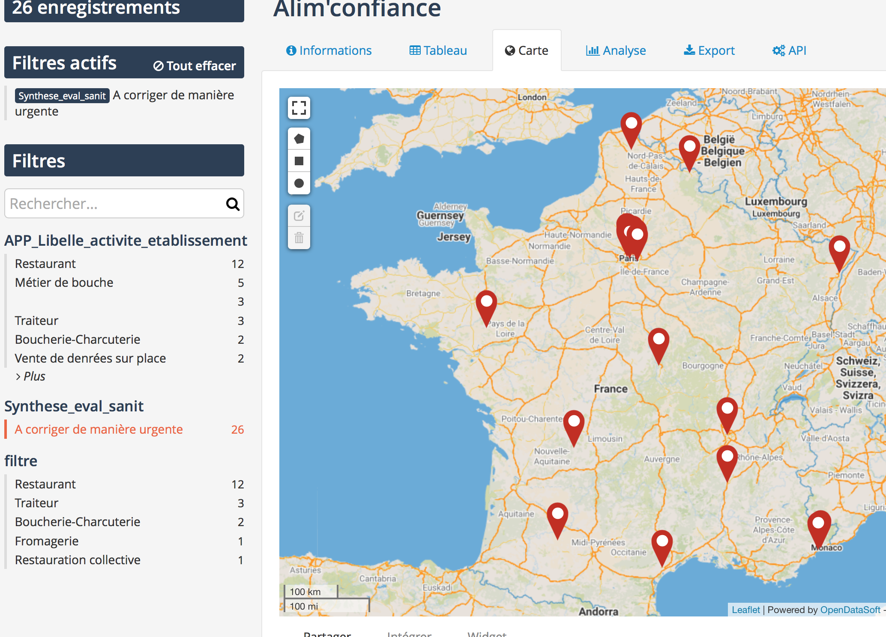

layout: true
  

`r paste0("
", params$event, " 

")` 

---

class: center, middle

Ces slides en ligne : `r paste0("http://joelgombin.github.io/", params$slug)`

Sources : `r paste0("https://github.com/joelgombin/", params$slug)`

Les productions de Datactivist sont librement réutilisables selon les termes de la licence [Creative Commons 4.0 BY-SA](https://creativecommons.org/licenses/by-sa/4.0/legalcode.fr).

 
 

.reduite[]

---

### We .red[open data], we make them .red[useful]

.reduite.center[]

---

### Objectifs de la séance

* Connaître les origines historiques de l’ouverture des données
* Connaître les grands principes de l’ouverture des données
* Connaître le cadre juridique de l’ouverture des données, de la loi CADA à la loi pour une République numérique
* Comprendre la place de l’ouverture des données dans la modernisation de l’État (open government et État plateforme)
* Connaître l'open data en 2022 grâce à des cas d'usage

???

* Savoir évaluer le niveau de maturité open data de son organisation : cf. https://airtable.com/shrr389QJ2KHOVfHj 

--

### Autres formations au programme
Voir http://datactivist.coop/oraccle

???

Ouvrez la présentation sur votre poste pour pouvoir suivre les liens

---

class: middle, center

### Avant de commencer : petit auto-portrait chinois

## Si j'étais une donnée, je serais...

.footnote[[Public Domain Review](https://publicdomainreview.org/collection/engravings-from-a-french-ice-skating-manual-1813)]

---
class: inverse, center, middle

# Rappel (ou non)

---

### Qu'est-ce qu'une donnée ?

--

.left-column[

]
 
 
.right-column[
> *Les données sont généralement comprises comme étant la matière première produite dans l’abstraction du monde en catégories, mesures et autres formes de représentation - nombres, caractères, symboles, images, sons, ondes électromagnétiques, bits - qui constituent les fondations sur lesquelles l’information et le savoir sont créés.*

]

---

---
class: inverse, center, middle

# Origines de l'open data

---

### [.red[Les multiples facettes]](https://books.openedition.org/cdf/5005?lang=fr)  de l'open data

.reduite.center[]

--
Selon vous, quelle facette est la plus proche du projet ORACCLE ?

---
### Open data : un terme récent

Le terme est apparu pour la première fois dans les années 1970 dans les accords qu’a signés la NASA avec des pays partenaires en vue du partage de données satellitaires. 

C’est en 1995 qu’on en voit le premier usage public aux Etats-Unis dans un rapport de la National Academy of Science intitutlé "_On the Full and Open Exchange of Scientific Data_".

Dans le langage courant, cela fait près de 10 ans que l'ouverture des données est devenue un élément majeur des politiques publiques numériques. 

** Explorons maintenant quelques grandes dates de l'apparition de l'open data.**

---
### 2005 : [Open Definition](https://opendefinition.org/)

#### Une définition juridique des droits de l'usager d'un savoir ouvert
.reduite[.center[]]

???

Open définition c'est la définition du mot "open". Licence la plus ouverte

---
### 2007 : [la rencontre de Sebastopol ](https://opengovdata.org/)

.pull-left[
**Quoi ?** Une rencontre de l'Open Governement Group à Sebastopol (Californie), siège des éditions O'Reilly

**Pourquoi ?** : Influencer le futur président des Etats Unis pour faire avancer l'open data

**Comment ?** En adoptant une déclaration définissant les grands principes de l'Open Government Data 

]

.pull-right[

]

???

"En décembre 2007, trente penseurs et activistes de l’Internet se sont donné rendez-vous à Sebastopol, au nord de San-Francisco. Leur objectif : définir le concept de données publiques ouvertes et le faire adopter par les candidats à l’élection présidentielle américaine. Les participants à la rencontre de Sebastopol sont issus pour la plupart des mouvements du logiciel et de la culture libres. Ces mouvements se trouvent au cœur de nombreuses innovations dans le domaine de l’informatique et d’Internet ces quinze dernières années.

On compte parmi eux Tim O’Reilly : auteur et éditeur américain, il est souvent à l’avant-garde des mouvements de l’informatique et de l’Internet, de l’open source jusqu’à l’expression même de Web 2.0 qu’il a définie et popularisée. 
Lawrence Lessig, professeur de droit à l’université de Stanford (Californie) est l’initiateur des licences Creative Commons, fondées sur l’idée du copyleft et de libre diffusion des connaissances.
Tom Steinberg (initiateur du site FixMyStreet)
Adrian Holovaty (le fondateur du service d’informations localisées EveryBlock)
Aaron Swartz, inventeur du système de flux RSS et militant de la connaissance libre

La contribution de Tim O’Reilly sur l’open government fait apparaître en pleine lumière la filiation entre le monde du « libre » et les principes émergents de l’open data : il s’agit clairement, explique-t-il, d’appliquer aux affaires publiques les principes de l’open source et ses méthodes de travail.

En 2007, cela pouvait apparaître comme un rêve. Mais le résultat a dépassé leurs espérances. Un peu plus d’un an plus tard, le président Barack Obama prend ses fonctions à la Maison-Blanche et signe trois mémorandums présidentiels. Deux d’entre eux concernent l’open government, dont l’open data est l’un des piliers. Les mémos du président placent explicitement l’action publique sous le signe de la culture de l’open source, en se réclamant de ses principes : « transparence, participation et collaboration »."

---
class:middle, center

# Revue des principes

---
### 2008 : Tim Berners-Lee ["Raw data now"](https://www.ted.com/talks/tim_berners_lee_on_the_next_web?language=fr)
#### La demande de données brutes sous les projecteurs

.reduite[.center[

]]

???

???

Principal inventeur du WWW. 
L’ouverture est enfin une injonction adressée aux détenteurs de données, tant publics que privés. Sur la scène de la conférence TED de 2009, Sir Tim Berners-Lee, l’inventeur des liens hypertextes et par extension du Web, pousse un cri de ralliement (pour les partisans d’un Web des données) et un cri de guerre aux détenteurs de données : « We want raw data, now ! » (vidéo: Tim Berners-Lee, TED, 2009). il encourage l'ensemble du monde à libérer leurs données afin de les connecter entre elles

---
### 2010 : [le modèle en 5 étoiles de Tim Berners-Lee](https://5stardata.info/fr/)

.reduite[.center[]]

---

### Un exemple de linked data : [Wikidata, le Wikipédia des données](https://www.wikidata.org/wiki/Wikidata:Main_Page)

.reduite[.center[]]

???

Université Paris Nord
HAL structure ID

SELECT ?item ?itemLabel ?countryLabel ?country 
WITH {    select distinct ?item {?item wdt:P31/wdt:P279* wd:Q3918} } AS %results  
WHERE {   INCLUDE %results.   ?item wdt:P17 ?country.?country wdt:P463 wd:Q458 .      SERVICE wikibase:label { bd:serviceParam wikibase:language "[AUTO_LANGUAGE],en". }  }

https://query.wikidata.org/#SELECT%20%3Fitem%20%3FitemLabel%20%3FcountryLabel%20%3Fcountry%20%0AWITH%20%7B%20%20%20%20select%20distinct%20%3Fitem%20%7B%3Fitem%20wdt%3AP31%2Fwdt%3AP279%2a%20wd%3AQ3918%7D%20%7D%20AS%20%25results%20%20%0AWHERE%20%7B%20%20%20INCLUDE%20%25results.%20%20%20%3Fitem%20wdt%3AP17%20%3Fcountry.%3Fcountry%20wdt%3AP463%20wd%3AQ458%20.%20%20%20%20%20%20SERVICE%20wikibase%3Alabel%20%7B%20bd%3AserviceParam%20wikibase%3Alanguage%20%22%5BAUTO_LANGUAGE%5D%2Cen%22.%20%7D%20%20%7D

---
### 2011 : [la déclaration pour un gouvernement ouvert](https://www.opengovpartnership.org/fr/process/joining-ogp/open-government-declaration/)

.reduite[.center[]]

---

---
## Des principes techniques sans portée politique
>"Il peut être vrai en un sens qu'un régime devient plus ouvert chaque fois qu'il fournit des données ouvertes supplémentaires, même pour les sujets banals et apolitiques, mais il est facile d'imaginer qu'un régime fermé pourrait divulguer de grandes quantités de données conformes à ces huit exigences [de Sébastopol] **sans pour autant accroître sa responsabilité réelle en tant que gouvernement **. 

> Une diffusion électronique des déclarations de propagande faites par les dirigeants politiques de la Corée du Nord, par exemple, pourrait satisfaire à ces huit exigences et ne pas promouvoir une transparence ou une responsabilité supplémentaires de la part d'un régime notoirement fermé et opaque."

>Yu & Robinson (2012) « [The New Ambiguity of Open Government](https://papers.ssrn.com/sol3/papers.cfm?abstract_id=2012489) » 

---
### Depuis 2010 : l'ère des classements

???

"https://opendatabarometer.org/?_year=2017&indicator=ODB
Evalue comment les Etats publient et utilisent les données ouvertes pour la reddition de compte, l'innovation l'impact social."

---
### Depuis 2010 : l'ère des classements

???
"https://index.okfn.org/place/
Classement qui évalue l'ouverture selon les catégorie de données. Les données les plus opaques : les dépenses du gouvernement et la propriété foncière"

---
### 2013 : la [charte du G8 sur l'open data](https://www.modernisation.gouv.fr/sites/default/files/fichiers-attaches/charte-g8-ouverture-donnees-publiques-fr.pdf)

???

"Le 18 juin 2013, les chefs d'État du G8 ont adopté et signé une Charte du G8 pour l'ouverture des données publiques3 ;

Y participent la Fr, l'All, l'Italie, le RU, le Japon, la Russie, le Canada, les USA

Dans un esprit d'ouverture et de transparence, cette charte pose les principes d'une donnée publique à désormais considérer comme « ouvertes par défaut »4 (sauf cas particulier liés à la défense et à la sécurité) ; cette donnée doit être mise à disposition « de qualité et en quantité ; accessibles et réutilisables par tous », gratuitement et avec une libre réutilisation pour tous3.

Les formats ouverts et non-propriétaires seront privilégiés et la charte encourage l’accès de tous à cette information, tout en promouvant l'innovation (entrepreneuriale, citoyenne et sociale)3.

Elle engage les États signataires à produire un « plan d'action national » avant fin 2013, et à mettre en œuvre (dans les 2 ans qui suivent (avant la fin 2015) tous les engagements collectifs détaillés dans l'annexe technique jointe à la charte

---
### 2015 : la [charte internationale de l'open data]()
.reduite[.center[

]]

???

"Les données ouvertes sont des données numériques accessibles dont les caractéristiques techniques et juridiques permettent la libre utilisation, réutilisation et redistribution par quiconque, en tout temps, en tout lieu.
1. Des données ouvertes par défaut
2. Des données diffusées en temps opportun et exhaustives
3. Des données accessibles et utilisables
4. Des données comparables et interopérables
5. Des données servant à l’amélioration de la gouvernance et de la participation citoyenne
6. Des données favorisant le développement inclusif et l’innovation
100 gouvernements ont adopté le texte : vingtaine de pays, reste ville ou local"

---
class: inverse, center, middle

# Les 8 principes de l'open data

---

class: middle, center

# 1. Des données complètes
### Toutes les données publiques doivent être rendues disponibles dans les limites légales liées à la vie privée ou la sécurité.
---
class: center, middle

# BY DEFAULT
---
class: middle, center

# 2. Des données primaires
###  Les données ouvertes sont telles que collectées à la source, non-agrégées avec le plus haut niveau de granularité

---
class: middle, center

# 3. Des données fraiches (*timely*)
### Les données doivent être disponibles dès qu'elles sont produites

---
class: middle, center

# 4. Des données accessibles 
### Les données doivent être utilisables par le plus grand nombre d’usagers potentiels

---
class: middle, center

# 5. Des données exploitables par les machines 
###  Les données peuvent être traitées automatiquement par les machines

---
class: middle, center

# 6. Des données non discriminatoires 
### Elles peuvent être utilisées par tous sans réclamer un enregistrement préalable
---
class: middle, center

# 7. Des données dans un format ouvert
### Ce format ne doit pas être la propriété d'une organisation en particulier (.xls) et doit être gouverné par ses usagers

---
class: middle, center

# 8. Des données dans une licence ouverte
### Idéalement dans le domaine public sinon dans une licence conforme à l'[Open Definition](https://opendefinition.org/od/2.1/en/) : Licence Ouverte (CC-BY) ou ODBL (CC-BY-SA)

---
class: center, middle

---
class: inverse, center, middle

# Éléments du cadre juridique de l'open data

---
### Le guide CADA-CNIL : le document de référence

Je n'indique ici que quelques éléments généraux sur le cadre juridique, ce guide constitue votre source de référence. Joël Gombin, co-fondateur de Datactivist, a publié sa [fiche de lecture](https://teamopendata.org/t/guide-commun-cnil-et-cada-open-data-rgpd/1320) sur TeamOpenData.

.reduite[.center[

]]

---

### 1978 : La loi CADA, vers le "droit de savoir"
* Le fondement : la .red[Déclaration des Droits de l'Homme et du Citoyen de 1789] dans son article 15, "la Société a le droit de demander compte à tout Agent public de son administration." 

* Le droit d'accès des citoyens à l'information publique émerge en **1978 avec la loi dite CADA** du nom de la Commission d'Accès aux Documents Administratifs. 

* La France était le .red[3e pays au monde] après la Suède en 1766 et les Etats-Unis en 1966 avec le Freedom of Information Act (FOIA) en 1966  à accorder un "droit de savoir" avec pour but d'améliorer les relations entre le public et l'administration.

.footnote[Il faudrait maintenant désigner la loi comme le Code des relations entre le public et l'administration (CRPA) qui, dans son [livre 3](https://www.legifrance.gouv.fr/affichCode.do;jsessionid=BDF8EC0BD562E214CCD9A5ADD435D690.tplgfr42s_1?idSectionTA=LEGISCTA000031367685&cidTexte=LEGITEXT000031366350&dateTexte=20190429), codifie le droit d'accès et de réutilisation mais il est encore moins connu que la loi CADA…]

???

Aux Etats-Unis, après le Freedom of Information Act de 1966 oblige les agences fédérales à transmettre les documents classifiés à tout citoyen qui en fait la demande. En France, la Commission d'accès aux documents administratifs, CADA, créée en 1976 fait de même. Mais il n'y a pas si longtemps, les citoyens qui s'adressaient à la CADA étaient soumis à de fastidieuses procédures administratives et l'attente d'une réponse était très longue... 

---
### La loi CADA : un point noir dans la transparence de la vie publique

Même si la France est le 3e pays à avoir adopté un droit d'accès, la loi CADA n'est pas un outil fort de la transparence de la vie publique. Ses principaux défauts : l'absence de sanctions et une procédure longue qui décourage les demandeurs et favorise le contournement par les administrations. 

 

---
### Un droit d'accès très faible au regard des standards internationaux

.pull-left[Paradoxe : la France a une législation parmi les plus ambitieuses au monde en matière d'open data mais le droit d'accès y est un des plus mauvais au monde… 

La France est classée .red[105e sur 123] du classement mondial des lois d'accès à l'information publique RTI Rating.

L'open data est comme la Tour de Pise : un très bel édifice posé sur des fondations instables.
]

.pull-right[

]

???

La notation RTI (Rght to information) est le principal outil mondial pour évaluer la solidité des cadres juridiques nationaux d'accès aux informations détenues par les autorités publiques (ou le droit à l'information, RTI). Il est largement utilisé par les organisations intergouvernementales, les défenseurs de la RTI, les réformateurs, les législateurs et autres.

---
### Les conditions d'exercice du droit d'accès

.red[ Une définition très large des documents administratifs]
> Les documents administratifs peuvent revêtir de nombreuses formes (dossiers, rapports, études, comptes rendus, procès-verbaux, statistiques, directives, instructions, circulaires, codes sources, etc.) et adopter tout support (écrit, enregistrement sonore ou visuel, forme numérique ou informatique). 

Le droit d'accès s'appplique aux documents administratifs produits dans le cadre d'une .red[mission de service public] ie :
> Une mission d'intérêt général sous le contrôle de l'administration et qui est dotée à cette fin de prérogatives de puissance publique est chargée de l'exécution d'un service public. 

Il ne s’exerce que si l’administration a effectivement en sa possession le document demandé, que si le document est formellement **achevé**, qu'il existe et qu'il n'est pas **préparatoire à une décision administrative** en cours. 

---
### Les exclusions au droit d'accès

Le droit d'accès .red[**ne doit pas porter atteinte aux secrets protégés**] : 
- le fonctionnement de l'État : délibérations du Gouvernement, secret de la défense nationale, la conduite de la politique extérieure de la France, la sûreté de l'État…
- la protection de la vie privée
- le secret médical
- le secret des affaires (secret des procédés, des informations économiques et financières et
des stratégies commerciales ou industrielle)
- les mentions portant une appréciation ou un jugement de valeur sur une personne physique ou
faisant apparaître un comportement d'une personne pouvant lui porter préjudice…

Le document ne peut être publié qu'après avoir fait l'objet d'un traitement permettant
d'.red[**occulter les mentions protégées**]. L’administration n’est pas tenue de publier un document lorsque “les travaux d’occultation dénatureraient ou videraient de sens le document” ou si “le document est indivisible ou l’occultation est trop complexe”.

???

Du large au particulier (à vérifier dans l'ordre)

---
### Le cas des données personnelles

La prohibition de la communication à des tiers ne porte pas sur les données personnelles en général, mais .red[**sur les données à caractère personnel relevant de la vie privée**] des personnes concernées (âge, coordonnées personnelles, situation patrimoniale et financière, sympathies politiques, les croyances religieuses…)

La mise en ligne de données à caractère personnel sans anonymisation n'est permise que dans .red[**trois cas**] :
1. une disposition législative contraire le prévoit (exemple : [Transparence Santé](https://www.data.gouv.fr/fr/datasets/transparence-sante-1/))
2. si les personnes intéressées ont donné leur accord (consentement au sens de l’article 4 du RGPD)
3. les documents relevant de [l’article D312-3-1 du CRPA](https://www.legifrance.gouv.fr/affichTexte.do;jsessionid=51E99AF738C12521572D6A7F6C8C03E8.tplgfr23s_1?cidTexte=JORFTEXT000037797147&dateTexte=&oldAction=rechJO&categorieLien=id&idJO=JORFCONT000037796937)

Hors de ces cas, il faut .red[**[anonymiser les données](https://github.com/SGMAP-AGD/anonymisation/wiki/Guide-de-l'anonymisation)**] : elles ne doivent plus se référer à une personne réelle (exit les noms, identifiants…) et ne doivent plus être spécifiques à un individu mais communes à un ensemble de personnes. L’indexation de ces données par un moteur de recherche externe est proscrite.

???

"La base de données publique Transparence - Santé rend accessible l'ensemble des informations déclarées par les entreprises sur les liens d'intérêts qu'elles entretiennent avec les acteurs du secteur de la santé.

article D312-3-1 du CRPA : code des relations entre le public et l'administration
les organigrammes, les annuaires des administrations et la liste des personnes inscrites à un tableau d'avancement ou sur une liste d'aptitude pour l'accès à un échelon, un grade ou un corps ou cadre d'emplois de la fonction publique ;
Les résultats obtenus par les candidats aux examens et concours administratifs ou conduisant à la délivrance des diplômes nationaux"

---

class: center, middle

---

### Loi pour une République Numérique : l'ouverture des données par défaut

Promulguée le 7 octobre 2016, après 4 ans d'annonces et de consultation, le titre 1 de la [loi pour une République  Numérique](https://www.legifrance.gouv.fr/affichTexte.do;jsessionid=B5632993E54F7CCC2606664B64CDF612.tpdila11v_1?cidTexte=JORFTEXT000033202746&categorieLien=id) porte sur l'ouverture des données publiques. 

La loi impose un principe d'.red[**ouverture des données par principe**] qui ne fait pas l'objet de sanctions à toutes les administrations, les entreprises délégataires d'une mission de service public et les .red[**collectivités locales de plus de 3500 habitants et 50 agents**]. 

L'ouverture concerne un .red[**périmètre très large**] : 
* les documents communiqués suite à des demandes CADA
* les "bases de données"
* les données "dont la publication présente un intérêt économique, social, sanitaire ou environnemental".
Rares sont donc les données publiques qui ne sont pas concernées par cette obligation d'ouverture. 

---

### La définition des données

Le guide CADA-CNIL rappelle la **définition des "bases de données"**

> On entend par base de données un recueil d'œuvres, de données ou d'autres éléments indépendants, disposés de manière systématique ou méthodique, et individuellement accessibles par des moyens électroniques ou par tout autre moyen (art L112-3 du code de la propriété intellectuelle)

> En d’autres termes il s’agit d’un ensemble de données organisé en vue de son utilisation par des programmes correspondant à des applications distinctes et de manière à faciliter l'évolution indépendante des données et des programmes (en anglais : data base)

Le document donne également une **définition de ce qu'est une "donnée"** :

> Une donnée correspond à la représentation d'une information sous une forme conventionnelle destinée à faciliter son traitement (en anglais : data).

---
### Loi pour une République numérique : l'utilisation de standards ouverts

Afin de faciliter la réutilisation des données par les machines, la loi pour une République Numérique consacre **l'utilisation de standards ouverts** pour la communication des documents administratifs. 

L’administration est dorénavant tenue, lorsqu’elle communique un document administratif au format électronique, de le mettre à disposition du citoyen **"dans un standard ouvert, aisément réutilisable et exploitable par un système de traitement automatisé"**. 

Concrètement, cela devrait empêcher la publication de fichiers PDF là où un fichier CSV pourrait être diffusé.

---
### Loi pour une République numérique : une limitation des licences

La loi **limite par décret les licences** qui peuvent être utilisées par les administrations. Le [décret du 27 avril 2017](https://www.legifrance.gouv.fr/eli/decret/2017/4/27/2017-638/jo/texte) autorise deux licences : 

* la Licence Ouverte d'Etalab 

* la licence ODbL (Open Database License).

Ces deux licences offrent **un choix aux administrations** : la licence ouverte étant plus permissive que la licence ODBL qui a été conçue dans une logique de "pot commun" permettant de garantir que les données resteront ouvertes après leur réutilisation.

Utiliser une autre licence impose une **homologation** auprès de la DINSIC avec un exposé des motifs ayant conduit à sortir de la liste fixée dans le décret et une consultation des usagers affectés par la licence proposée. L'homologation doit être faite pour chaque jeu de données même si la licence reste la même.

---
### Loi pour une République numérique : une limitation des licences

.reduite.center[

]
.footnote[source : [SGAR Occitanie](http://www.opendatalab.fr/index.php/laboratoire/le-kit-collectivites)]

---
### Du droit d'accès du droit de réutilisation

.reduite.center[

]

???

Révision PSI 2007 données géogpraphique systèmes d'information, des sols, etc...

---
class: center, middle

---
class: inverse, center, middle

# Où en est l'open data en 2022 ?

---

### Le cadre juridique européen à venir

Le [Data Governance Act (DGA)](https://en.wikipedia.org/wiki/Data_Governance_Act) proposé par la commission en 2020 et adopté récemment induit de nouvelles notions : 

* Altruisme des données (entreprises privées, open data et individus) : mise à disposition de données au service de l'intérêt général [Les cahiers de l'observatoire DataPublica](https://www.data-publica.eu/portfolio/items/premier-cahier-de-l-observatoire)
* Services d'intermédiation de données : qui fournira un environnement sécurisé dans lequel les entreprises ou les particuliers pourront partager des données. [Conseil de l'UE](https://www.consilium.europa.eu/en/press/press-releases/2022/05/16/le-conseil-approuve-l-acte-sur-la-gouvernance-des-donnees/)
* Espaces de données personnelles
* etc...

#### En France, on parle de plus en plus de Données d'Intérêt Général : 

"Certaines données, bien que pas nécessairement produites ou détenues par la puissance publique, présentent un intérêt tel qu’elles justifient que la puissance publique puisse y accéder" [Joël Gombin sur #TeamOpenData](https://teamopendata.org/t/donnees-dinteret-general-donnees-de-reference-donnees-essentielles/1066)

---
class: center, middle

### Les données d'intérêt général

 
[Les cahiers de l'observatoire DataPublica](https://www.data-publica.eu/portfolio/items/premier-cahier-de-l-observatoire)

---

class: center, middle

???
www.wooclap.com/YMPDCA

---

class: center, middle

### Les données d'intérêt général

 
[Feuille de route AMDAC du Ministère de l'Éducation Nationale et de la Jeunesse](https://static.data.gouv.fr/resources/feuilles-de-route-ministerielles-sur-la-politique-de-la-donnee-des-algorithmes-et-des-codes-sources/20220411-140150/pour-une-politique-de-la-donn-e-ambitieuse-au-service-de-l-cole-de-la-jeunesse-et-des-sports-104165.pdf)

---

### Des politiques d'open data "de l'offre"

.pull-left[
### En théorie

#### Toutes les données sont ouvertes sous leur forme brute dès leur production

]
.pull-right[

### En pratique

#### L’administration choisit quelles données ouvrir, comment les ouvrir, quand et ce qu’elles contiennent

]

---
### La réutilisation : un parcours fait de frictions et de déceptions

.pull-left[

]
.pull-right[
####  Des données difficiles à trouver, pas ouvertes partout

####  Granularité temporelle et spatiale souvent trop faible

####  Des données souvent inutilisables : manque de documentation

####  Des données pas mises à jour

####  Des portails qui ciblent les développeurs

]

---
### Le problème de la qualité des données

> **Les données des gouvernements sont souvent incomplètes, pas actualisées, de mauvaise qualité et fragmentaires.** 

> Dans la plupart des cas, les catalogues ou portails de données ouvertes sont alimentés manuellement, conséquence d’une approche informelle de la gestion des données. 

> De plus, les procédures, les calendriers et les responsabilités des institutions publiques chargées de leur gestion manquent souvent de clarté. Ainsi, de manière générale, la gestion et la publication des données ouvertes sont fragiles et sujettes à des erreurs multiples.

.footnote[Source : 
[Rapport mondial du 4e Open Data Barometer](https://opendatabarometer.org/4thedition/report/?lang=fr)
]
---
### Des données bien cachées
.pull-left[

]
.pull-right[
"La découvrabilité des données est un défi majeur. Nous avons des portails et des registres de données, mais les organismes gouvernementaux qui relèvent d'un seul gouvernement national publient toujours les données de différentes façons et à différents endroits (...).

**La découvrabilité des données est une condition préalable pour que les données ouvertes réalisent leur potentiel et, actuellement, la plupart des données sont très difficiles à trouver**."]

.footnote[https://index.okfn.org/insights/]

---
### Un exemple de données introuvables

Ce fichier contient tous les signes officiels de la qualité et de l'origine (SIQO) : les AOC et AOP, IGP, Label rouge, spécialité traditionnelle garantie, Agriculture biologique… Très utile mais qui peut le trouver sur data.gouv.fr ?

---
### Un autre exemple de données vraiment introuvables 

Ce jeu de données contient plus de 6000 marchés publics attribués par l'Etat. Mais, malgré plusieurs [signalements](https://www.data.gouv.fr/fr/datasets/aife-de-44785462100045/#discussion-5c5d2857634f41019657c80d-0), tout est fait pour le rendre introuvable !

[.reduite[]](https://www.data.gouv.fr/fr/datasets/aife-de-44785462100045/)
---

### Le développement de l'open data en France

.reduite.center

---

### Le développement de l'open data en France

.reduite.center[

]

---

### Une multitude de portails territoriaux

---
### Une multitude de portails nationaux

---
### Une multitude de solutions de portails sur le marché

--

#### Tour d'horizon de ces solutions
---
### Exemple de données ouvertes : la [base SIRENE](https://www.data.gouv.fr/fr/datasets/base-sirene-des-entreprises-et-de-leurs-etablissements-siren-siret/)

.reduite.center[]
---
### La base SIRENE : exemple de cas d'utilisation

.reduite[.center[]]
---
### Exemple de données ouvertes : la [base adresse nationale](https://www.data.gouv.fr/fr/datasets/base-adresse-nationale/)
.reduite[.center[]]

---
### Exemple de données ouvertes : les [accidents de la route](https://www.data.gouv.fr/fr/datasets/base-de-donnees-accidents-corporels-de-la-circulation/)
.reduite.center[]
---
### Exemple de données ouvertes : Les accidents de la route
.reduite.center[]
.footnote[Plus d'accidents sur l'A8 mais surtout plus de véhicules…]
---
### Exemple de données ouvertes : les accidents de la route
.reduite.center[]
.footnote[[Carte par Joël Gombin dans Marsactu](https://joelgombin.github.io/marsactu_accidents/chronique.html)]
---
### Exemple de données ouvertes : les [inspections des restaurants](https://www.data.gouv.fr/fr/datasets/resultats-des-controles-officiels-sanitaires-dispositif-dinformation-alimconfiance/)
.reduite.center[]
.footnote[[Résultats des contrôles officiels sanitaires : dispositif d'information « Alim’confiance »](https://www.data.gouv.fr/fr/datasets/resultats-des-controles-officiels-sanitaires-dispositif-dinformation-alimconfiance/)]
---
### Exemple de données ouvertes : les inspections des restaurants
.reduite[.center[]]
.footnote[[155 établissements dont l'hygiène doit être corrigée de manière urgente ](https://dgal.opendatasoft.com/explore/dataset/export_alimconfiance/table/?disjunctive.filtre&disjunctive.app_libelle_activite_etablissement&disjunctive.ods_type_activite&refine.synthese_eval_sanit=A+corriger+de+mani%C3%A8re+urgente)]
---
### Exemple de données ouvertes : le [répertoire national des élus](https://www.data.gouv.fr/fr/datasets/donnees-du-repertoire-national-des-elus/)

.reduite.center[

]

---
### Exemple de données ouvertes : les [valeurs foncières](https://www.data.gouv.fr/fr/datasets/demandes-de-valeurs-foncieres/#_)

---
### Exemple de données ouvertes : les valeurs foncières

.reduite.center[

]

---
### Exemple de données ouvertes : [Santé Publique France sur la Covid-19](https://www.data.gouv.fr/fr/datasets/donnees-hospitalieres-relatives-a-lepidemie-de-covid-19/)

---
### Exemple de données ouvertes : [Campagnes photographiques des Monuments Historiques](https://data.culture.gouv.fr/explore/dataset/photographies-serie-monuments-historiques-de-1851-a-1914/images/?refine.nom_reg=BRETAGNE&refine.nom_dept=FINISTERE&dataChart=eyJxdWVyaWVzIjpbeyJjaGFydHMiOlt7InR5cGUiOiJjb2x1bW4iLCJmdW5jIjoiQ09VTlQiLCJzY2llbnRpZmljRGlzcGxheSI6dHJ1ZSwiY29sb3IiOiIjNjZjMmE1In1dLCJ4QXhpcyI6Im5vbV9yZWciLCJtYXhwb2ludHMiOjUwLCJzb3J0IjoiIiwiY29uZmlnIjp7ImRhdGFzZXQiOiJwaG90b2dyYXBoaWVzLXNlcmllLW1vbnVtZW50cy1oaXN0b3JpcXVlcy1kZS0xODUxLWEtMTkxNCIsIm9wdGlvbnMiOnt9fX1dLCJ0aW1lc2NhbGUiOiIiLCJkaXNwbGF5TGVnZW5kIjp0cnVlLCJhbGlnbk1vbnRoIjp0cnVlfQ%3D%3D&location=5,46.50652,2.39891)

---
### Exemple de données ouvertes : [Les AD des Hauts-de-Seine](https://opendata.hauts-de-seine.fr/explore/dataset/cartes-postales/information/)

Un projet mélant open data et indexation collaborative

---

class: inverse, center, middle

# Découverte de l'open data universitaire !

---

class: center, middle

### À vous jouer !

https://padlet.com/datactivist/icbddv3t7s54j7jk 

---

class: inverse, center, middle

# Ressources

---

### Ressources

* [**Guide pratique dédié à l’ouverture des données publiques culturelles**](http://www.culture.gouv.fr/Media/Thematiques/Innovation-numerique/Folder/Guide-pratique-dedie-a-l-ouverture-des-donnees-publiques-culturelles)
Publié par le ministère de la Culture, juillet 2019 

* [**Outil pédagogique facilitant la compréhension des droits de propriété littéraire et artistique applicables aux contenus culturels dont la diffusion est souhaitée**](https://www.culture.gouv.fr/droitsdediffusion/) 

* [**Numérisation et valorisation des contenus culturels : guide ouverture et réutilisation des informations publiques numériques du secteur culturel**](http://www.culture.gouv.fr/Media/Thematiques/Innovation-numerique/Folder/Livrables-GT-Numerisation/Numerisation-et-valorisation-des-contenus-culturels-guide-ouverture-et-reutilisation-des-informations-publiques-numeriques-du-secteur-culturel),publié par le ministère de la Culture, 2017

* [**Guide de bonnes pratiques en matière de propriété littéraire et artistique**](http://www.culture.gouv.fr/Media/Thematiques/Innovation-numerique/Folder/Livrables-GT-Numerisation/Guide-de-bonnes-pratiques-en-matiere-de-propriete-litteraire-et-artistique), publié par le ministère de la Culture, 2017

* [**Rapport "Ouverture et partage des données publiques culturelles"**](https://www.culture.gouv.fr/content/download/94768/file/201312_Rapport_Open_Data_Culturel.pdf), publié par le ministère de la Culture, décembre 2013

---

### Ressources

* [**Rapport open content dans les institutions culturelles en France**](https://upload.wikimedia.org/wikipedia/commons/9/94/Rapport_sur_l%E2%80%99open_content_dans_les_institutions_culturelles_en_France_-_%C3%89tat_des_lieux_des_pratiques_num%C3%A9riques_et_d%E2%80%99ouverture_de_contenus.pdf), Wikimédia, 2022

* [**Retour d'expérience sur la mise en ligne des collections du musée de Bretagne**](https://musee-devoile.blog/wp-content/uploads/2021/05/fiches_juridiques_musee_de_bretagne.pdf)

* [**Penser demain, L’Open Innovation dans les Musées & Institutions Culturelles**](https://www.icart.fr/actualites/elaboration-dun-livre-blanc-sur-lopen-innovation), l'ICART 

* [**Guide pratique pour la recherche et la réutilisation des images d’œuvres d’art**](https://www.inha.fr/fr/actualites/actualites-de-l-inha/en-2021/guide-pratique-pour-la-recherche-et-la-reutilisation-des-images-d-uvres-d-art.html), INHA

* [**Droits des images, histoire de l’art et société**](https://www.inha.fr/_attachments/de-nouvelles-democraties-du-savoir-actualite/rapport_images_usages221018.pdf)

---

class: inverse, center, middle

# Merci !

Contact : [samuel@datactivist.coop](mailto:samuel@datactivist.coop) [annelaure@datactivist.coop](mailto:annelaure@datactivist.coop)
[clement@datactivist.coop](mailto:clement@datactivist.coop)